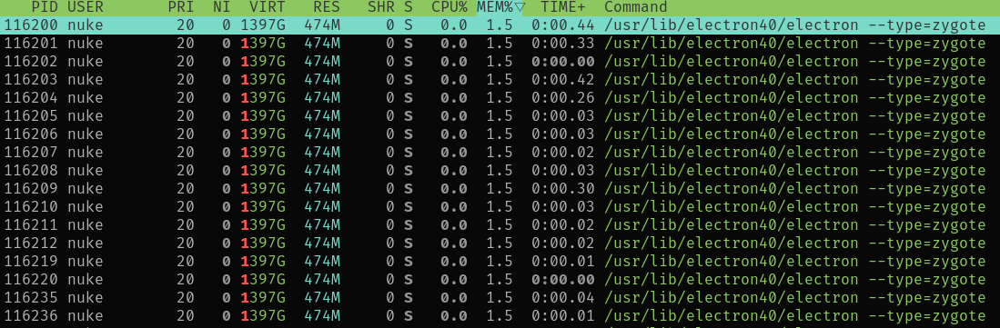
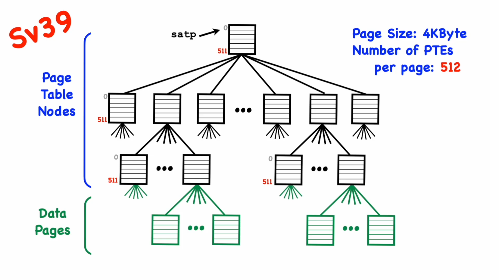
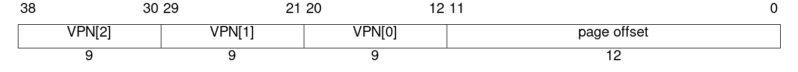
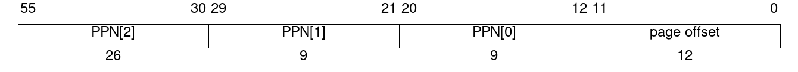
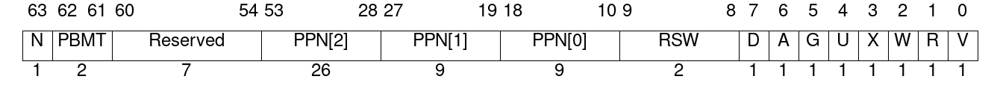

# Lab 1 - Memory management and virtual memory support (weight: 2)

**Attention**: on Sunday March 22nd the RISC-V Privileged ISA Manual
webpage we've been using so far, which is hosted as a static github.io
page, broke due to
a [commit](https://github.com/riscv/riscv-isa-manual/commit/25b3fbce6777d85fd1f2682f8c64c298f345a9c6)
in the [riscv/riscv-isa-manual](https://github.com/riscv/riscv-isa-manual)
repository. We hope this will be fixed soon, but in the meantime you
can grab a PDF copy of the RISC-V spec
[here](https://docs.riscv.org/reference/isa/_attachments/riscv-privileged.pdf).

## Theoretical overview

As we discussed in our classes and in Lab 0, one of the key roles of an
operating system kernel is **managing access to system resources**, in
particular to **memory**. The way this is done in modern operating systems
is through an abstraction called *virtual memory*.

### Why virtual memory?

Imagine that in your operating system, all processes share the same address
space, that is, everybody accesses the system physical memory (RAM) directly.
Now imagine that you have two browser tabs open, each on running on its own
process -- in one you are accessing your bank account through a secure
connection to your bank's website, and on the other one you are reading a news
article. Then you accidentally click on an ad in the news tab that opens a
malicious webpage. If all processes have direct access to physical memory, that
means an attacker can hijack your secure session on the other tab and get
access to your bank account information.

Furthermore, it's not uncommon to see something like this these days:



A single instance of Discord has requested a whopping **1397 GB** of memory to
the operating system (this is a very common pattern in
[Electron](https://www.electronjs.org/) apps). Clearly no personal machine
these days has that much memory, so the kernel is doing some kind of trickery
to convince the greedy application that it has all that memory available, while
working under the hood to make sure that the data the application is actually
using can fit into RAM.

The trick to both cases is **virtual memory**: each process in the machine
"sees" memory as a 64-bit virtual address space that is entirely accessible to
the process. Those virtual address spaces are **isolated** between processes,
which means that one process cannot normally access the virtual address space
of another process. Internally, the kernel is responsible for associating
each **virtual address** in a process' address space to a **physical address**
in the system memory.

### How is virtual memory implemented

First off, when managing memory, one usually works in units of **pages**
(instead of bytes). A page is a block of memory of fixed size, usually **4096
bytes = 4KiB**. 

Inside your computer, there is a hardware unit called the Memory Management
Unit (MMU). This piece of hardware sits between the CPU cores and the memory
bus and is responsible for translating between virtual and physical addresses
upon every load/store that is issued by the CPU. The kernel is able to
configure the `VA <-> PA` mappings done by the MMU by setting up a set of data
structures called **page tables**, that describe how to map a **virtual memory
page** to a **physical memory page**.

A **page table** (PTB) is an array of **page table entries** (PTE).
Page tables are usually organized in a multi-level, tree-like structure (to be
more precise, a [radix tree](https://en.wikipedia.org/wiki/Radix_tree)), such
that each PTE encodes either a pointer to another PTB (non-leaf PTE) or the
address of a physical page that a virtual page points to (leaf PTE).



### Paging support in RISC-V

First off, we recommend that you watch the following videos (made by Prof.
Harry Porter, from Portland State University) to get an overview of how virtual
memory is implemented in RISC-V:

- [Virtual Memory #1: Page Tables, PTEs, Sv32](https://www.youtube.com/watch?v=oXKg351zd84)
- [Virtual Memory #5: Sv39, Sv48, Sv57](https://www.youtube.com/watch?v=iJwDOW1KfZg)

For this lab we will use the Sv39 paging mode:
[Page-Based 39-bit Virtual-Memory System](https://riscv.github.io/riscv-isa-manual/snapshot/privileged/#sv39),

This paging mode uses a 3-level page tables to map virtual pages to physical
pages. A **page table** (PTB) is a page in memory used to keep information of
other pages in memory; more specifically, it is an array of (in Sv39) 2^9 = 512
elements called **page table entries** (PTEs). Note that each PTE is a word, i.e.,
a 64-bit number, such that `512 * 64 bits = 512 * 8 bytes = 4096 bytes`.

The first allocated PTB is called the **root page table**, and in our kernel we
store it in the `kernel_root_ptb` global variable; its address will be written to
the `satp` CSR when we're ready to enable paging, and the MMU will walk the page
tables starting from the root PTB for every memory access after paging is enabled.

The virtual addresses in Sv39 are designed as follows:



Each `VPN[x]` (virtual page number) field encodes an index into the level `x`
PTB. Notice how each `VPN[x]` field is 9 bits -- because each PTB hold 2^9
PTEs.

In more detail, for a virtual address `VA`:
- `VPN[2]`: bits `VA[38:30]` represent the index within the level 2 (root) page table
- `VPN[1]`: bits `VA[29:21]` represent the index within the level 1 page table
- `VPN[0]`: bits `VA[20:12]` represent the index within the level 0 page table 
- `page offset`: bits `VA[11,0]` represent the offset within the virtual page (which we
  ignore when walking the page tables)

**Attention**: note that the levels *decrease* when we go deeper into the page table walk,
i.e, `level 2` is considered the first level (root PTB).

**Attention**: another detail to look out for is that, according to the Sv39 spec:

> Instruction fetch addresses and load and store effective addresses, which are 64 bits, must have bits 63–39 all equal to bit 38, or else a page-fault exception will occur.

The physical addresses in Sv39 are designed as follows:



For a physical address `PA`:
- `PPN[2:0]`: bits `PA[55:12]` represent the physical page number (i.e. `PA / PAGE_SIZE`)
    - Notice how all address within the same 4KB range lie within the same page; e.g.
      addresses `0xabcd000 - 0xabcdfff` all lie within PPN `0xabcd`
- `OFFSET`: bits `VA[11:0]` represent the offset within the page (not relevant to us)

A page table entry in Sv39 is designed as follows:



For this lab, we are only interested in only a few bits, namely:
- `PPN[2:0]`: bits `PTE[53,10]` to represent the physical page number (PPN) that this PTE points to
-  `X`: bit `PTE[3]` indicates if the mapped page is executable
-  `W`: bit `PTE[2]` indicates if the mapped page is writable
-  `R`: bit `PTE[1]` indicates if the mapped page is readable
-  `V`: bit `PTE[0]` indicates if the PTE is valid

Note that bits `RWX = 0` indicate that the PTE is a non-leaf entry (i.e. its
PPN field points to the next level PTB). Having `RWX = 0` in a PTE at the
last-level PTB will cause the MMU to raise an exception for accesses to that page.

### Mapping virtual pages

The basic algorithm for mapping a virtual address `VA` into a physical addres `PA` goes as follows:

- Assert that `VA` and `PA` are page-aligned
- Assert that bits 63-38 are all equal to each other
- Start at the kernel root PTB; calculate `VPN[2]`, `VPN[1]` and `VPN[0]` from `VA`
- At the level 2 PTB:
    - Look at the PTE at index `VPN[2]`
    - Check if bit `V` is set:
        - If it is, go to the level 1 PTB whose physical page is encoded in the PPN field of the PTE
        - If it isn't, allocate a PTB, then set the PPN field of the PTE to the physical page number of
          the newly-created PTB (which becomes the next level 1 PTB); go to the new level 1 PTB
- At the level 1 PTB:
    - Look at the PTE at index `VPN[1]`
    - Check if bit `V` is set:
        - If it is, go to the level 0 PTB whose physical page is encoded in the PPN field of the PTE
        - If it isn't, allocate a PTB, then set the PPN field of the PTE to the physical page number of
          the newly-created PTB (which becomes the next level 0 PTB); go to the new level 0 PTB
- At the level 0 PTB (last level):
    - Look at the PTE at index `VPN[0]`
    - Check if bit `V` is set:
        - If it is, this virtual address has already been mapped, so return an error
        - If it isn't, create a new PTE with its PPN field set to the physical page number of `PA` and
          set the appropriate R/W/X flags and write it to the PTE at index `VPN[0]` in the level 0 PTB

# Lab instructions

## Objectives

The objective of this lab is to implement basic memory functionality into
the kernel we started building in Lab 0. Upon completion you will have implemented:

- A basic but working physical page allocator
- Code to manipulate the system page tables in order to map virtual pages to physical pages
  (leveraging the physical allocator you've written to allocate PTBs along the way)
- Code to leverage both of the above to configure an identity mapping for the kernel
  virtual address space

## Running tests

Several things can go wrong when implementing paging support, since loading the
new page tables means that either everything is set up correctly (unlikely) and
your code gets to live another day, or that you made mistakes along the way and
your kernel will simply hang at some point due to unhandled page faults (we
will go over more details about exceptions in Lab 02).

Since this task is probably the biggest hurdle that hobbyist OS developers face
early on when writing a kernel from scratch, we have written a comprehensive set
of tests to validate the different parts of your code that will be critical to
complete the lab. You can run those tests by running the following from the root
of the repository:

```
$ meson compile -C build run_tests
```

Note that these tests will also be used to grade your submission, so make sure
to pass as many of them as you can.

## Part 1: implementing helpers (20%)

Your first task will be to write the helpers listed in
[include/arch/pgtable.h](../include/arch/pgtable.h) in order to
implement common operations that you will use when manipulating data
structures such as PTBs (`struct pgtable`), PTEs (`pte_t`), as well
as virtual (`u64`) and physical (`phys_addr_t`) addresses.

You can find the Sv39 specification in the following sections of the
RISC-V Privileged ISA Manual:

- [Section 12.1.11. Supervisor Address Translation and Protection (satp) Register](https://riscv.github.io/riscv-isa-manual/snapshot/privileged/#satp)
- [12.4. Sv39: Page-Based 39-bit Virtual-Memory System](https://riscv.github.io/riscv-isa-manual/snapshot/privileged/#sv39)

The grade for this part of the lab will be calculated from the results of
the following test suites:

- `page_unit_tests`
- `virt_addr_unit_tests`
- `ppn_unit_tests`
- `pte_unit_tests`

## Part 2: implementing a physical memory allocator (30%)

The memory allocator is an essential tool for memory management, and its
function is to keep a record of all the pages in memory that are free to use.
The allocator will give the tools to our OS to allocate memory dinamically, it
will be very important when we grow our kernel to support multiple concurrent
processes and need to manage the memory resources between the processes -- the
kernel needs to allocate physical pages as needed and also needs to recover
pages that are no longer in use.

Your second task will be to implement a physical memory allocator in
[`src/alloc.c`](../src/alloc.c). Which data structure you will use to
implement it is up to you, just remember that for this initial
implementation of the allocator, our kernel does not support dynamic
allocation, and therefore all the allocator data structures need to be
declared statically in the memory. Here are some examples of simple data
structures commonly used for this task:

- **stack**: a stack of addresses corresponding to free physical pages
    - Normally implemented on top of a static array
- **bytemap**: an array of bytes in which each element tracks whether a
  physical page is available
    - e.g. `bytemap[3]` tracks whether PPN 3 is available
- **bitmap**: an array of bytes in which each bit tracks wheter a physical
  page is available
    - Same idea as the bytemap but more space-efficient
    - e.g. bit 0 of byte 0 tracks whether PPN 0 is available, bit 1 of
      byte 0 checks whether PPN 1, is available, ..., bit `i` of byte
      `n` checks whether PPN `n * 8 + i` is available
- **freelist**: a linked list of free pages
    - Keep in mind that this list has to be implemented on top of a static
      data structure (e.g. a static array)
    - This is used in the 
      [xv6 kernel](https://github.com/mit-pdos/xv6-riscv/blob/riscv/kernel/kalloc.c) 
      (but the list elements are stored at the beginning of each physical page)

For more examples, you can check out the [OSDev Wiki](https://wiki.osdev.org/Page_Frame_Allocation).

Your allocator should provide the following API:

- `alloc_init`: initialize the internal state of the allocator
    - Any attempts to allocate/free memory _before_ calling this should fail
- `alloc_get_page`: allocate a physical memory page and return its address
- `alloc_free_page`: free a physical memory page (e.g. add it back to the pool of free pages that your allocator uses internally)
- `alloc_zero_page`: same as `alloc_get_page` but zero the contents of the page before returning

Be sure to take a look at the file 
[`include/kernel/alloc.h`](../include/kernel/alloc.h), where the
functions above are declared and documented, and write your implementation in
`src/alloc.c`.

The grade for this part of the lab will be calculated from the results of
the following test suites:
- `alloc_test_suite`

## Part 3: implementing paging support (50%)

For the third and final part of the lab, your task will be to implement
paging support for the kernel. To this end, you should implement the
following functions in [`src/mm.c`](../src/mm.c):

- `vm_map_page()`: map a virtual page address into a physical page address
    - Walk the page tables from level 2 (root page table) to level 0,
      eventually reaching a leaf PTE and initializing its PPN field to
      point to the appropriate physical page. Remember that you will need
      to allocate the intermediate page tables as you go.
- `mm_init()`: map all relevant sections of the kernel into virtual memory
    - Allocate the root page table (stored in the `kernel_root_ptb` variable)
    - Take a look the `mm_init_kmap` function we provided for you; it initializes
      a `struct memory_layout_t kmap` containing the start/end addresses of all
      kernel sections
    - Use `vm_map_page` to set up **identity mappings** for all kernel sections
        - For example, suppose `.text` starts at `0x80000000`; it should have
          read-execute permissions
        - Then you should map virtual page `0x80000000` -> physical page `0x80000000`,
          and set the R and X bits; something like `vm_map_page(0x80000000, 0x80000000, PTE_READ | PTE_EXEC)`
    - **Important**: also set up an identity map for physical page `0x10000000`
        - This contains the emulated serial device that `printf` writes to
          in order to print to the console when we run our kernel inside
          QEMU
        - Failing to map this will make your kernel hang
    - Finally, also set up a mapping for the zero page (at virtual address 0x0)
      with permissions RWX=0
        - This will cause a page fault whenever we try to access a null pointer.
          Now you know how Linux catches null pointer dereferences. :-)

Finally, you should flip the switch by uncommenting the piece of code in `vm_init` that enables paging.

The grade for this part of the lab will be calculated from the results of
the following test suites:
- `vm_map_tests`

